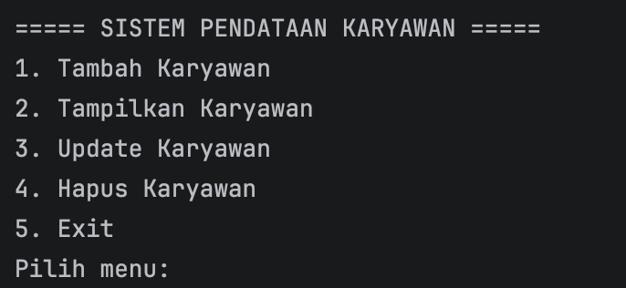
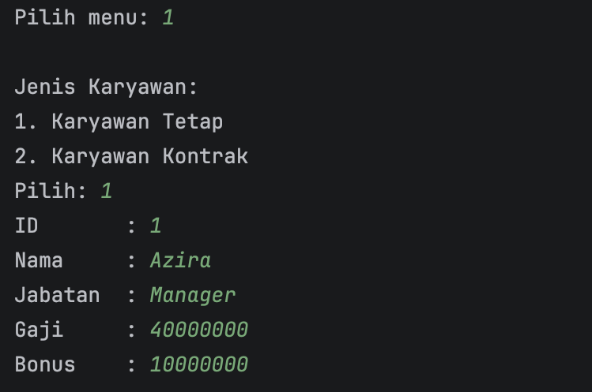
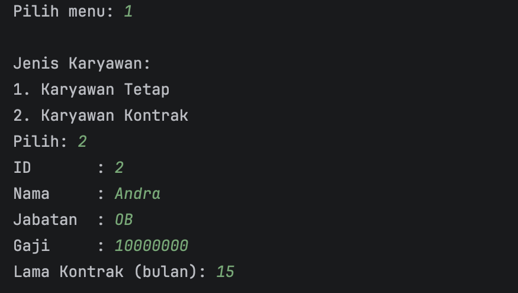
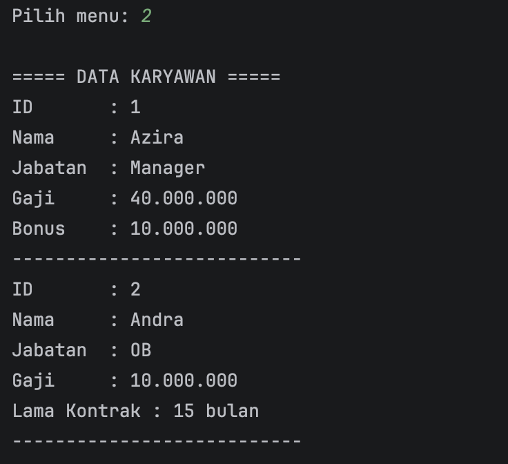

# LAPORAN PRAKTIKUM
# PEMROGRAMAN BERBASIS OBJEK

## Posttest 3

### Sistem Pendataan Karyawan di Perusahaan

---

## Identitas

NIM : 2409106016
Nama : Azira Faradina
Mata Kuliah : Pemrograman Berorientasi Objek

---

## Deskripsi Program

Program ini merupakan pengembangan dari Posttest sebelumnya dengan menambahkan konsep **Inheritance** pada sistem pendataan karyawan.

Program mampu melakukan:

* Tambah data karyawan tetap
* Tambah data karyawan kontrak
* Menampilkan data

---

## Konsep yang Digunakan

### 1. Inheritance

Inheritance adalah proses pewarisan atribut dan method dari superclass ke subclass.

Pada program ini:

* `Karyawan` sebagai superclass
* `KaryawanTetap` dan `KaryawanKontrak` sebagai subclass

Relasi yang digunakan adalah **is-a relationship**:

* KaryawanTetap adalah Karyawan
* KaryawanKontrak adalah Karyawan

---

### 2. Tipe Inheritance

Program ini menggunakan **Hierarchical Inheritance**, yaitu satu superclass memiliki lebih dari satu subclass.

---

### 3. Penggunaan Keyword

* `extends` → untuk pewarisan
* `super` → memanggil constructor superclass
* `@Override` → override method

---

### Screenshot Output

1. Menu Program

   
2. Tambah Karyawan

   
   
3. Tampilkan Karyawan

   

---

## Kesimpulan

Dengan menerapkan inheritance, program menjadi lebih terstruktur dan tidak perlu mengulang atribut yang sama. Setiap jenis karyawan dapat memiliki karakteristik masing-masing tanpa mengubah struktur utama.
