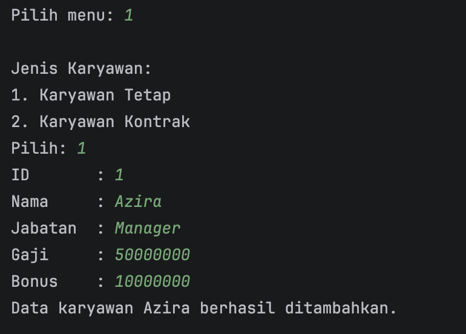
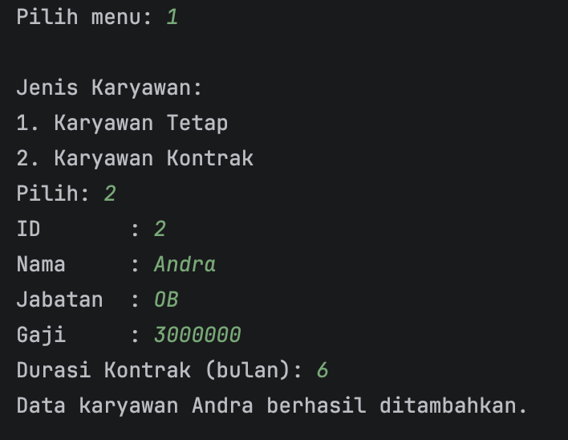
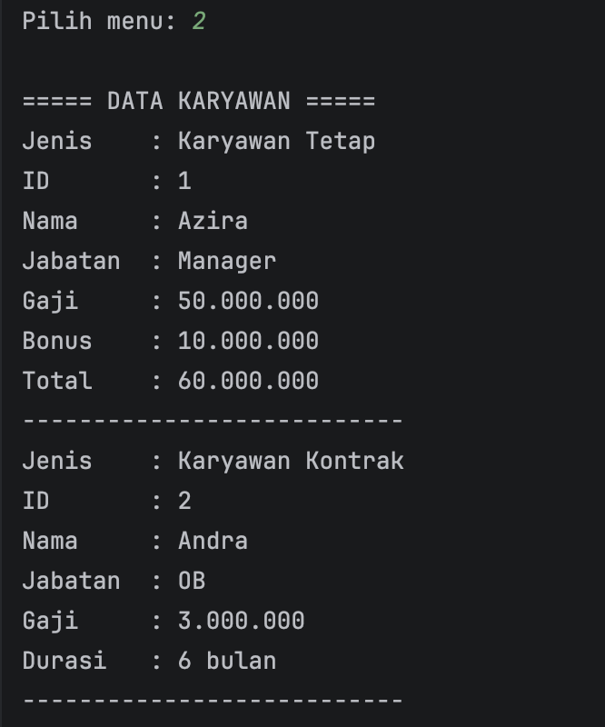
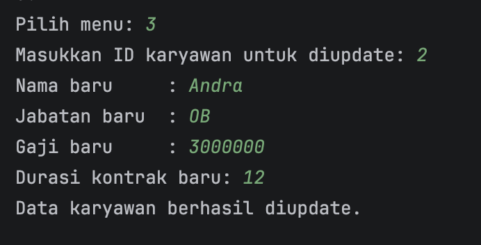
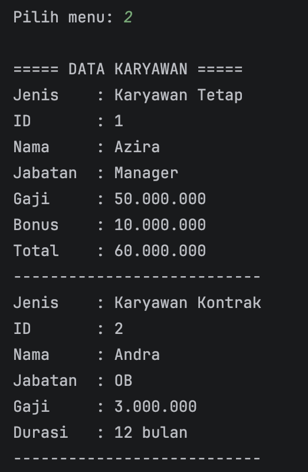

# LAPORAN PRAKTIKUM
# PEMROGRAMAN BERBASIS OBJEK

## Posttest 4

### Sistem Pendataan Karyawan di Perusahaan

---

## Identitas

NIM : 2409106016
Nama : Azira Faradina
Mata Kuliah : Pemrograman Berorientasi Objek

---

## Deskripsi Program

Program ini merupakan pengembangan dari posttest sebelumnya dengan menambahkan konsep **polymorphism** pada sistem pendataan karyawan.

Program masih memiliki fungsi utama yang sama seperti sebelumnya, yaitu:

* Menambahkan data karyawan
* Menampilkan data karyawan
* Mengupdate data karyawan
* Menghapus data karyawan

Perbedaannya terletak pada cara program menangani method yang sama tetapi memiliki perilaku berbeda, tergantung pada jenis objek yang digunakan.

---

## Konsep yang Digunakan

### 1. Inheritance

Program menggunakan konsep pewarisan class, di mana:

* `Karyawan` sebagai superclass
* `KaryawanTetap` dan `KaryawanKontrak` sebagai subclass

Subclass mewarisi atribut dan method dari superclass, namun dapat memiliki tambahan atribut dan perilaku masing-masing.

---

### 2. Polymorphism

Polymorphism adalah kemampuan sebuah method untuk memiliki banyak bentuk. Dalam program ini digunakan dua jenis polymorphism, yaitu method overloading dan method overriding.

---

### 2.1 Method Overloading

Method overloading diterapkan pada method `setGaji`, yaitu:

```java
public void setGaji(double gaji) {
    this.gaji = gaji;
}

public void setGaji(double gaji, double bonusTambahan) {
    this.gaji = gaji + bonusTambahan;
}
```

Method ini memiliki nama yang sama tetapi parameter yang berbeda.

Penggunaan method ini tidak dilakukan pada proses update data, melainkan digunakan pada perhitungan total gaji saat data ditampilkan. Hal ini dilakukan agar nilai gaji utama tetap tersimpan sebagai gaji pokok dan tidak tercampur dengan bonus.

---

### 2.2 Method Overriding

Method overriding diterapkan pada method `read()` dan `getInfo()`.

Pada class `Karyawan`, method `read()` digunakan untuk menampilkan data umum seperti ID, nama, jabatan, dan gaji.

Kemudian pada subclass:

* `KaryawanTetap` menambahkan informasi bonus
* `KaryawanKontrak` menambahkan informasi lama kontrak

Setiap subclass memiliki implementasi method `read()` yang berbeda, meskipun nama methodnya sama.

Selain itu, method `getInfo()` juga dioverride untuk menampilkan jenis karyawan, sehingga setiap objek dapat memberikan informasi yang sesuai dengan tipenya.

---

### 2.3 Polymorphism dalam Program

Polymorphism terlihat pada saat menampilkan data:

```java
for (Karyawan k : dataKaryawan) {
    System.out.println("Jenis    : " + k.getInfo());
    k.read();
}
```

Pada bagian ini:

* Tipe referensi adalah `Karyawan`
* Namun objek yang disimpan bisa berupa `KaryawanTetap` atau `KaryawanKontrak`

Saat method dipanggil, Java akan menjalankan method sesuai dengan jenis objek sebenarnya.

---

## Perubahan dari Posttest Sebelumnya

Beberapa perubahan yang dilakukan pada program ini adalah:

1. Menambahkan method overloading pada `setGaji`
2. Menambahkan method overriding pada `read()` dan `getInfo()`
3. Menampilkan jenis karyawan menggunakan method `getInfo()`
4. Menambahkan perhitungan total gaji (gaji + bonus) pada karyawan tetap
5. Tetap mempertahankan struktur program sebelumnya (CRUD dan inheritance)

Perubahan ini dilakukan tanpa mengubah struktur utama program, sehingga program tetap konsisten dengan posttest sebelumnya.

---

## Contoh Output

```text
===== DATA KARYAWAN =====
Jenis    : Karyawan Tetap
ID       : 1
Nama     : Azira
Jabatan  : Manager
Gaji     : 60,000,000
Bonus    : 20,000,000
Total    : 80,000,000
---------------------------
```

### Screenshot Output

1. Menu Program

   
2. Tambah Karyawan

   
   
3. Tampilkan Karyawan

   
4. Update Karyawan

   
   

---

## Kesimpulan

Dengan penerapan polymorphism, program menjadi lebih fleksibel karena satu method dapat memiliki perilaku yang berbeda tergantung pada objek yang digunakan.

Method overriding memungkinkan setiap subclass memiliki implementasi sendiri, sedangkan method overloading memberikan variasi penggunaan method dalam satu class.

Penerapan konsep ini membuat program lebih terstruktur, mudah dikembangkan, dan sesuai dengan prinsip pemrograman berorientasi objek.
