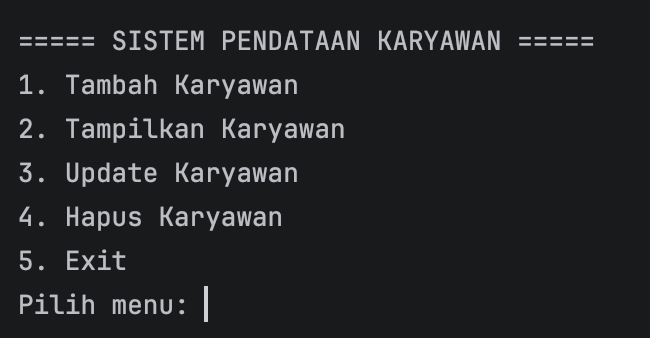
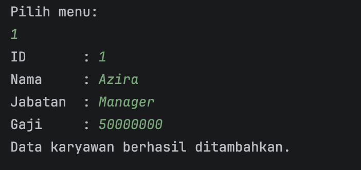
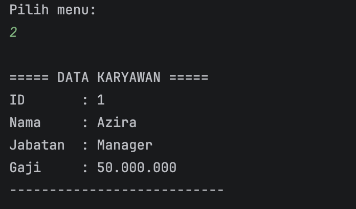
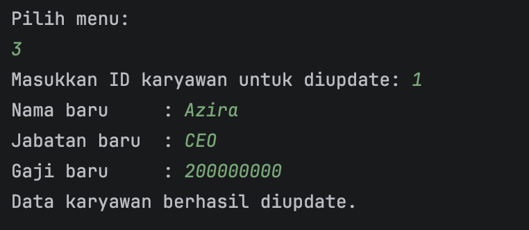
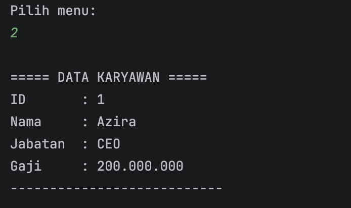
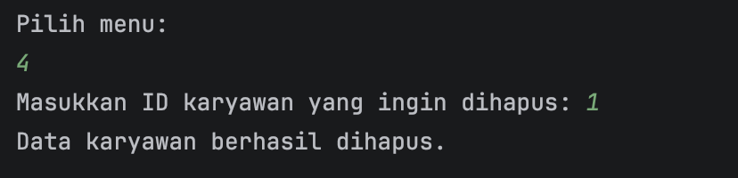
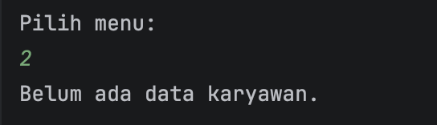
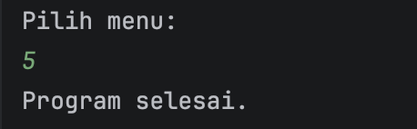

# LAPORAN PRAKTIKUM
# PEMROGRAMAN BERBASIS OBJEK

## Posttest 1

### Sistem Pendataan Karyawan di Perusahaan

---

# 1. Identitas Praktikum

- NIM : 2409106016  
- Nama : Azira Faradina  
- Mata Kuliah : Pemrograman Berorientasi Objek  
- Judul : Sistem Pendataan Karyawan di Perusahaan  

# 2. Latar Belakang

Dalam dunia industri maupun organisasi, pengelolaan data karyawan merupakan hal yang sangat penting. Data karyawan biasanya mencakup informasi seperti identitas karyawan, jabatan, serta gaji yang diterima. Pengelolaan data secara manual dapat menimbulkan berbagai masalah seperti kesalahan pencatatan, kesulitan dalam pencarian data, serta ketidakefisienan dalam pengolahan informasi.

Seiring dengan perkembangan teknologi informasi, pengelolaan data dapat dilakukan secara digital menggunakan program komputer. Dengan memanfaatkan bahasa pemrograman, sebuah sistem sederhana dapat dibuat untuk membantu proses pendataan karyawan secara lebih efektif dan terstruktur.

Pada praktikum ini dibuat sebuah program sederhana menggunakan bahasa pemrograman Java dengan menerapkan konsep Pemrograman Berorientasi Objek (Object Oriented Programming / OOP). Program ini dirancang untuk mengelola data karyawan melalui beberapa operasi dasar seperti menambahkan data, menampilkan data, memperbarui data, serta menghapus data.

Selain itu, program juga menggunakan struktur data ArrayList untuk menyimpan data karyawan secara dinamis sehingga jumlah data dapat bertambah maupun berkurang sesuai kebutuhan pengguna.

---

# 3. Tujuan Praktikum

Tujuan dari praktikum ini adalah sebagai berikut:

1. Memahami konsep dasar Pemrograman Berorientasi Objek (OOP) dalam bahasa Java.
2. Mempelajari cara membuat dan menggunakan class dan object.
3. Memahami penggunaan ArrayList sebagai struktur data dinamis.
4. Mengimplementasikan operasi CRUD (Create, Read, Update, Delete) pada suatu program.
5. Membuat program dengan menu interaktif yang dapat berjalan secara berulang sampai pengguna memilih keluar dari program.

---

# 4. Perancangan Program

Program ini terdiri dari dua class utama yaitu:

### 1. Class Karyawan

Class ini berfungsi untuk menyimpan data karyawan. Atribut yang digunakan antara lain:

* id
* nama
* jabatan
* gaji

Class ini juga memiliki method `show()` yang digunakan untuk menampilkan data karyawan.

### 2. Class Main

Class Main merupakan class utama yang digunakan untuk menjalankan program. Class ini berisi:

* menu program
* method CRUD
* ArrayList untuk menyimpan objek karyawan

Program menggunakan **perulangan do-while** sehingga menu akan terus muncul sampai pengguna memilih menu **Exit**.

---

# 5. Hasil Program

Program akan menampilkan menu utama yang berisi beberapa pilihan, yaitu:

1. Tambah Karyawan
2. Tampilkan Karyawan
3. Update Karyawan
4. Hapus Karyawan
5. Exit

Pengguna dapat memilih salah satu menu untuk menjalankan fungsi tertentu dalam sistem.

### Screenshot Output

1. Menu Program
   
2. Tambah Karyawan
   
3. Tampilkan Karyawan
   
4. Update Karyawan
   
   
5. Hapus Karyawan
   
   
6. Exit
   
---

# 6. Kesimpulan

Berdasarkan praktikum yang telah dilakukan, dapat disimpulkan bahwa konsep Pemrograman Berorientasi Objek (OOP) sangat membantu dalam merancang program yang terstruktur dan mudah dikembangkan.

Dengan menggunakan class dan object, data karyawan dapat direpresentasikan secara lebih jelas dalam bentuk objek. Selain itu, penggunaan ArrayList memungkinkan penyimpanan data secara dinamis sehingga program dapat menambah maupun menghapus data dengan mudah.

Program Sistem Pendataan Karyawan ini juga mengimplementasikan konsep CRUD yang merupakan operasi dasar dalam pengolahan data. Melalui menu interaktif, pengguna dapat melakukan pengelolaan data karyawan secara sederhana dan sistematis.

Program ini masih dapat dikembangkan lebih lanjut dengan menambahkan fitur lain seperti pencarian data, validasi input, serta tampilan yang lebih kompleks.
